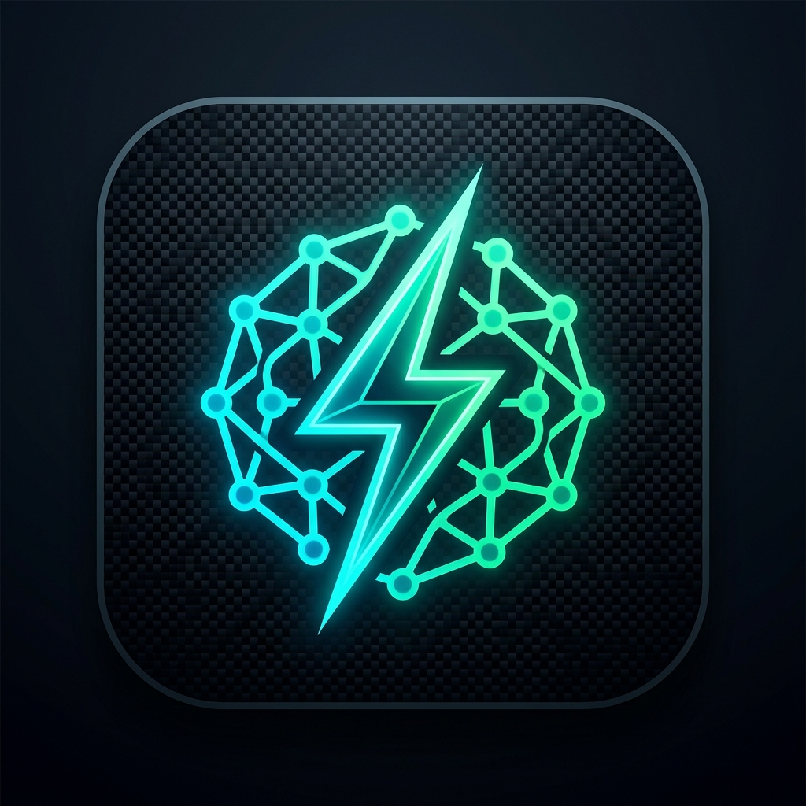

<p align="center">
  
</p>

<p align="center">
  <a href="https://github.com/steph4n-gh/reflex"></a>
</p>

<h1 align="center">Reflex: Machine-Native System 1 Decision Runtime</h1>

<p align="center">
  <strong>Sub-1ms non-autoregressive decision engine on local metal with conformal safety gating and zero data egress.</strong>
</p>

<p align="center">
  <a href="https://github.com/steph4n-gh/reflex/actions/workflows/ci.yml"></a>
  <a href="LICENSE"></a>
  <a href="pyproject.toml"></a>
  <a href="tests/"></a>
  <a href="examples/"></a>
  <a href="#-privacy--zero-data-egress"></a>
</p>

<p align="center">
  <a href="#-why-reflex-and-system-1">Why Reflex & System 1?</a> •
  <a href="#-30-second-quickstart">30s Quickstart</a> •
  <a href="#-dual-process-cognitive-architecture-2026-edition">2026 Cognitive Stack</a> •
  <a href="#-the-4-tier-1-architectural-levers">4 Levers</a> •
  <a href="#-production-demo--benchmark-catalog-17-demos">Demos (17)</a> •
  <a href="#-privacy--zero-data-egress">Privacy</a> •
  <a href="#-1-line-typesafe-ai--jev-drop-in">TypeSafe Drop-in</a> •
  <a href="#-cli-reference">CLI</a>
</p>

---

## 💡 Why "Reflex" AND "System 1"?

Developers often ask: *Is this project called Reflex or System 1?*

| Dimension | Concept | Purpose & Scope |
|---|---|---|
| **The Product & Runtime Brand** | **Reflex** | The official open-source package name, repo (`reflex`), CLI command (`reflex`), and framework brand. It captures the machine-native reaction speed (< 1ms on local metal) and non-autoregressive execution. |
| **The Cognitive Paradigm** | **System 1** | Daniel Kahneman’s foundational framework (*Thinking, Fast and Slow*). Reflex implements the machine-native **System 1 (fast, instinctive reflex)** layer of the agentic cognitive stack, designed to pair with a deliberate **System 2 (slow governor)** like Project Astra, Fable, or Claude. |
| **Twin-Namespace Ergonomics** | `import reflex`<br>`import system1` | Full 1:1 symmetry. `import reflex` is the primary modern brand. `import system1` is a complete, first-class twin alias for cognitive architecture purists and backwards compatibility. Both share identical 92 exports and 15 submodules. |

```python
import reflex
import system1

# 100% symmetric API parity
assert reflex.__version__ == system1.__version__ == "0.1.0"
assert reflex.ReflexEngine is system1.ReflexEngine
```

---

## ⚡ 30-Second Quickstart

Install Reflex in any Python 3.11+ environment (**pure NumPy BLAS default**, zero external dependencies required):

```bash
pip install reflex
# or: pip install system1
```

Define a strongly typed decision schema and evaluate it directly on the metal in **< 1ms**:

```python
from reflex import DecisionSchema, ChoiceField, ReflexEngine

class SecurityTriage(DecisionSchema):
    action = ChoiceField(
        options=["ALLOW", "QUARANTINE", "BLOCK"],
        descriptions={
            "ALLOW": "Benign read-only operational request",
            "QUARANTINE": "Unrecognized or abnormal data access pattern",
            "BLOCK": "Active exploit, prompt injection, or malicious payload",
        }
    )

# Single forward pass on local CPU/Metal in ~1.0 ms ($0.00 token cost, 0 bytes egress)
engine = ReflexEngine(SecurityTriage)
decision = engine.decide("Suspicious outbound SSH traffic")

print(f"Action:  {decision.values['action']}")
print(f"Latency: {decision.latency_ms:.2f} ms")
```

---

## 🧠 Dual-Process Cognitive Architecture (2026 Edition)

In the late-2026 agentic landscape, foundation models have evolved into formidable **deliberative reasoning governors**:
- **OpenAI**: The **Astra** multimodal model, the flagship **GPT-6 series**, and the successors to GPT-5.6: **Sol**, **Terra**, and **Luna**.
- **Anthropic**: **Claude Opus 5**, **Fable 5.1**, and **Mythos 5**.
- **Google**: **Gemini 3.1 Pro** and **Gemini 3.8 Flash**.

### The Real-Time Dilemma: Why Agents Fail at High Frequency
Every frontier LLM call incurs **300ms to 2,000ms+ latency**, costs real API dollars, and leaks proprietary context over the public internet. Running a monolithic cloud reasoning model for every routine check causes interactive systems (voice assistants, robotics, 60 FPS games, and microservice firewalls) to choke.

**Reflex provides the missing System 1 layer:**

<p align="center">
  
</p>

### The Fast vs. Slow Dichotomy

| Dimension | System 1: Local Reflex Engine | System 2: Deliberative Governor (Late 2026) |
|---|---|---|
| **Exemplars** | **Reflex** (Metal GPU `mlx` / NumPy BLAS) | **OpenAI Astra & GPT-6 / Sol / Terra / Luna**, **Anthropic Opus 5 / Fable 5.1 / Mythos 5**, **Google Gemini 3.1 Pro & 3.8 Flash** |
| **Cognitive Role** | Instinctive, reflex actions, guardrails | Strategic planning, edge-case resolution, reflection |
| **Decision Latency** | **< 1.0 ms P50 empirical SLA** (< 10µs cache hit) | 300 ms – 3,000 ms+ (WAN transit + autoregressive thinking) |
| **Marginal Cost** | **$0.00 / decision** (Fixed local CPU/GPU compute) | Variable token billing ($5.00 – $30.00+ per MTok) |
| **Data Privacy** | **Zero Data Egress** (100% on-device, air-gapped) | External network exposure, prompt leakage risk |
| **Traffic Share** | Handles **95% – 99%+** of routine decisions | Reserved strictly for the **1% – 5%** ambiguous edge cases |

### The Cognitive Feedback Loop
1. **System 1 Forward Pass (< 1ms)**: Computes multi-field decision probabilities in a single matrix multiplication directly on local hardware.
2. **Conformal Safety Gate (Finite-Sample $1-\alpha$)**: Mathematically verifies decision confidence. If the margin is dominant and conformal set size $|\mathcal{C}(\mathbf{x})| = 1$, System 1 executes immediately on the metal.
3. **Fail-Closed Escalation**: If the input is genuinely ambiguous or out-of-distribution ($|\mathcal{C}(\mathbf{x})| > 1$), Reflex **halts fail-closed** and escalates to System 2 (OpenAI Astra / GPT-6, Anthropic Opus 5 / Fable 5.1 / Mythos 5, Google Gemini 3.1 Pro).
4. **Online Sherman-Morrison Distillation (< 50µs)**: When System 2 provides the ground-truth resolution $\mathbf{y}^*$, Reflex performs an instant closed-form rank-1 covariance update:
   $$P_{t+1} = P_t - \frac{P_t \mathbf{x} \mathbf{x}^T P_t}{1 + \mathbf{x}^T P_t \mathbf{x}}, \quad W_{t+1} = (P_{t+1} B_{t+1})^T$$
   This immediately rotates System 1's hyperplanes. Future occurrences are handled locally in `< 0.01ms` (**escalation collapse**).

---

## ⚡ The 4 Tier-1 Architectural Levers

Reflex implements four synergistic levers that crush latency and eliminate cloud escalations:

<p align="center">
  
</p>

<details>
<summary><strong>Expand Details & Code Examples for the 4 Levers</strong></summary>

### 1. Lever 1: Tier 0 Semantic Reflex Cache (L1) — Sub-10µs
Combines an exact $O(1)$ SHA-256 hash table with a vectorized cosine similarity table ($\ge 	au \approx 0.98$). Bypasses forward evaluation for recurring queries.
```python
engine = ReflexEngine(SecurityTriage, use_cache=True, cache_threshold=0.98)
res1 = engine.decide("GET /health")  # Cold forward pass: ~1.0 ms
res2 = engine.decide("GET /health")  # Warm L1 cache hit: ~9.8 µs (100x speedup!)
assert res2.is_cache_hit is True
```

### 2. Lever 2: Online Sherman-Morrison Distillation — Sub-50µs
Instantly distills teacher feedback directly into local hyperplanes without retraining or GPU backpropagation.
```python
engine.learn_from_tier2(
    prompt="Unseen zero-day attack vector",
    target={"action": "BLOCK"}
)
# Next call resolves locally on-device with zero cloud escalation
assert engine.decide("Unseen zero-day attack vector").values["action"] == "BLOCK"
```

### 3. Lever 3: Margin-Based Conformal Gating
Measures the margin of dominance $M(\mathbf{x}) = s_{(1)} - s_{(2)}$. If $M(\mathbf{x}) \ge 	au_{\text{margin}}$ (e.g. 0.15), false escalations are suppressed while maintaining rigorous statistical guarantees.

### 4. Lever 4: Continuous Telemetry State Vector Fusion
Normalizes live continuous operational signals (CPU pressure, memory, latency P99, error rates) and fuses them into the semantic feature space ($\mathbf{v}_{\text{fused}} = (1-\beta)\mathbf{v}_{\text{text}} + \beta \mathbf{W}_{\text{telemetry}}\mathbf{t}_{\text{norm}}$). The same prompt adapts dynamically under stress.
```python
res_norm = engine.evaluate("Worker node health", telemetry={"cpu": 15.0, "error_rate": 0.001})
res_crit = engine.evaluate("Worker node health", telemetry={"cpu": 99.2, "error_rate": 0.85})
```
</details>

---

## 🎮 Flagship Showcases

### 1. 60 FPS Pokémon on the Metal (Game Boy Emulation)
Game Boy emulators run at **60 frames per second (16.6ms per frame)**. Cloud LLMs take 300–1,500ms and cost real tokens per button press. 
Reflex evaluates PyBoy Game Boy RAM directly, generating battle commands and overworld navigation in **~38 microseconds** on CPU metal (**25,000+ QPS**).

```bash
# Instant Live Combat Window (bypasses intro, starts in Rival 1 combat in 0.7s)
python3 examples/pokemon_gameboy_gui.py --game red --mode battle --speed 1

# Headless Multi-Cartridge Benchmark across all 6 Game Boy ROMs (10,000+ FPS)
python3 examples/pokemon_all_games_benchmark.py
```

### 2. Universal Paperclips + TypeSafe AI (Jev) Drop-in
Recreates Diogo Almeida's (CEO of TypeSafe AI / Jev) viral demo playing Frank Lantz's *Universal Paperclips*:
- **1-Line `patch_typesafe()`**: Redirects cloud TypeSafe calls to Reflex running on local Apple Silicon Metal.
- **Dual-Pane ASCII HUD**: Visualizes manufacturing metrics on the left and calibrated probability bars on the right.
- **4 Operational Modes**: `dropin` (100% local metal), `baseline` (simulated cloud), `compare` (head-to-head local vs WAN), and `cutover` (Trojan Horse apprentice-to-metal auto-transition).

```bash
# Run local drop-in mode on Apple Silicon Metal
python3 examples/paperclips_typesafe_dropin.py --mode dropin --steps 5

# Run side-by-side head-to-head comparison against cloud baseline
python3 examples/paperclips_typesafe_dropin.py --mode compare --steps 3

# Run Trojan Horse auto-cutover (cloud apprentice -> 100% local metal)
python3 examples/paperclips_typesafe_dropin.py --mode cutover --steps 5 --threshold 3
```

---

## 🚀 Production Demo & Benchmark Catalog (17 Demos)

Reflex includes **17 production demonstrations and empirical benchmarks** organized across 4 domains:

| # | Demo / Benchmark | Script | Primary Domain | Latency / Highlights |
|:---:|---|---|---|---|
| **1** | **Headless Multi-Cartridge Pokémon Benchmark** | `examples/pokemon_all_games_benchmark.py` | Real-Time Gaming | 10,000+ FPS, 38µs neural forward pass |
| **2** | **60 FPS Autonomous Battle Reflex Agent** | `examples/pokemon_battle_reflex.py` | Real-Time Gaming | Sub-1ms battle decisions, PyBoy RAM extraction |
| **3** | **10-Chapter Campaign Speedrun Engine** | `examples/pokemon_full_campaign_speedrun.py` | Long-Horizon Control | Pallet Town to Indigo Plateau, 8-badge trophy board |
| **4** | **Live Game Boy Spectator GUI** | `examples/pokemon_gameboy_gui.py` | Interactive GUI | Live desktop window, 0.2s turbo intro skip |
| **5** | **Autonomous Agent Security Firewall** | `examples/autonomous_agent_firewall_showcase.py` | Enterprise Security | 48 attack vectors, CVSS scoring, 1,000+ QPS stress |
| **6** | **Enterprise Multi-Threaded Stress Runner** | `examples/enterprise_stress_showcase.py` | Concurrency & Ledger | Concurrent tool evaluation, SQLite WAL ActionLedger |
| **7** | **Agent Tool Guard & ActionLedger** | `examples/agent_guard.py` | Audit & Verification | Fail-closed tool interception, SHA-256 hash chaining |
| **8** | **"Trojan Horse" Autonomous Cutover** | `examples/auto_cutover_showcase.py` | Migration Engine | Shadow distillation from SaaS APIs to 100% local metal |
| **9** | **Deep Moat Benchmark vs. TypeSafe AI** | `examples/deep_jev_benchmark.py` | Latency & Moat Audit | Apple Silicon Metal vs cloud API (150x+ speedup) |
| **10** | **TypeSafe SDK Drop-in Validation** | `examples/typesafe_sdk_dropin_showcase.py` | API Compatibility | Zero-code-change drop-in validation for `typesafe` |
| **11** | **4 Jev Enterprise Use-Case Comparison** | `examples/jev_comparison_demos.py` | Head-to-Head | Routing, triage, tool auth vs TypeSafe AI |
| **12** | **5 Enterprise Killer Use Cases Live Test** | `examples/killer_use_cases_live_test.py` | Enterprise Evaluation | Financial, medical, and security multi-domain tests |
| **13** | **Universal Paperclips + Jev Drop-in** | `examples/paperclips_typesafe_dropin.py` | Agent Simulation | 1-line patch, 4 modes, dual-pane ASCII HUD |
| **14** | **4 Tier 1 Levers Empirical Benchmark** | `examples/four_levers_benchmark.py` | Cognitive Architecture | L1 cache (<10µs), Sherman-Morrison (<50µs) |
| **15** | **Pure NumPy Standalone Evaluator** | `examples/core_standalone_evaluator.py` | Embedded / Zero-Dep | Pure NumPy `<0.5ms` forward pass, 0 crypto/SQLite deps |
| **16** | **Front-Line AI Gateway Router** | `examples/model_routing.py` | AI Gateway Routing | Cache vs local vs frontier routing with conformal bounds |
| **17** | **Customer Support Ticket Triage** | `examples/support_triage.py` | NLP Classification | Department routing, urgency, frustration index in ~1ms |

<details>
<summary><strong>Expand Execution Commands for All 17 Demos</strong></summary>

```bash
# Gaming & Control
python3 examples/pokemon_all_games_benchmark.py
python3 examples/pokemon_battle_reflex.py
python3 examples/pokemon_full_campaign_speedrun.py
python3 examples/pokemon_gameboy_gui.py

# Enterprise Security & Firewalls
python3 examples/autonomous_agent_firewall_showcase.py
python3 examples/enterprise_stress_showcase.py
python3 examples/agent_guard.py

# Migration Engine & TypeSafe Drop-in
python3 examples/auto_cutover_showcase.py
python3 examples/deep_jev_benchmark.py
python3 examples/typesafe_sdk_dropin_showcase.py
python3 examples/jev_comparison_demos.py
python3 examples/killer_use_cases_live_test.py
python3 examples/paperclips_typesafe_dropin.py --mode dropin

# Architecture Levers & Core Evaluator
python3 examples/four_levers_benchmark.py
python3 examples/core_standalone_evaluator.py
python3 examples/model_routing.py
python3 examples/support_triage.py
```
</details>

---

## 🔒 Privacy & Zero Data Egress

Reflex guarantees **Zero External Network Egress** and absolute local data isolation:

```
┌────────────────────────────────────────────────────────────────────────┐
│                        AIR-GAPPED LOCAL METAL                          │
│                                                                        │
│   Prompt / Action Proposal                                             │
│              │                                                         │
│              ▼                                                         │
│   ┌──────────────────────┐                                             │
│   │ Reflex Decision Core │  In-Memory Forward Pass (NumPy / Metal)     │
│   └──────────┬───────────┘                                             │
│              │ In-Process                                              │
│              ▼                                                         │
│   ┌──────────────────────┐    ┌──────────────────────────────────┐     │
│   │ Local SQLite Ledger  │◄───│ On-Device Ed25519 Private Key     │     │
│   │ (audit_trail.db)     │    │ (~/.system1/identity)            │     │
│   └──────────────────────┘    └──────────────────────────────────┘     │
└───────────────────────────────────┬────────────────────────────────────┘
                                    │
                           XXXXXXXX │ XXXXXXXX
                          NO OUTBOUND NETWORK SOCKETS
                           (0 Bytes Ever Transmitted)
```

- **100% On-Device Execution**: All inference, calibration, and cryptographic receipt generation run in-process in host memory. Zero web sockets, zero telemetry pings, zero cloud dependencies.
- **Enterprise Regulatory Compliance**:
  - **HIPAA**: Protected Health Information (PHI) never crosses a network boundary.
  - **GDPR**: PII evaluated on-premise without international data transfers.
  - **SOC 2 Type II**: Tamper-evident `DecisionWitnessReceipt` signed by on-device Ed25519 keys with SHA-256 SQLite hash chaining.

---

## 🔄 1-Line TypeSafe AI / Jev Drop-in

Drop Reflex into any existing codebase that uses `typesafe` or `typesafe_sdk`:

```python
# 1-Line Drop-in Replacement
from reflex.compat.typesafe import patch_typesafe
patch_typesafe()

# Existing code now runs 100% on local metal at sub-2ms with $0 cost:
import typesafe
client = typesafe.Client()
```

### Autonomous "Trojan Horse" Cutover
Migrate transparently from cloud APIs with zero downtime:

```python
from reflex.compat.typesafe import TypeSafeClient

# Proxy first 50 calls to cloud API, record exemplars, then cut over to local metal:
client = TypeSafeClient(
    mode="auto_cutover",
    cutover_threshold=50,
    api_key="typesafe_live_key",
)
```

---

## 🛠️ CLI Reference

Reflex provides a unified command-line tool accessible identically as either `reflex` or `system1`:

```bash
# Run a structured decision
reflex decide "How do I reset my password?" --schema triage --json

# Run benchmark against 20ms real-time frame ceiling
reflex bench --schema triage --iterations 200 --target 20.0

# Verify an Ed25519 decision witness receipt offline
reflex verify-receipt path/to/receipt.json
cat receipt.json | reflex verify-receipt

# Calibrate temperature and conformal sets
reflex calibrate --dataset data.json --schema triage --bins 10

# Compile schema into standalone portable <20KB binary model (.s1m)
reflex compile --schema triage --output triage.s1m --json
```

---

## 🧪 Testing & Certification

```bash
python3 -m pytest tests/ -v
```

- **Tests Passing**: **366 passed** (100% pass rate in ~24s)
- **Failures / Errors**: **0**
- **Warnings**: **0**
- **CI Platforms**: Verified clean on macOS Apple Silicon and Linux runners (Python 3.11, 3.12, 3.13).

---

## 🎨 Visual Assets & Media

All diagrams, branding, and vector media are maintained in [`assets/`](https://github.com/steph4n-gh/reflex/blob/main/assets/):

| Asset | Format | Resolution | Description |
|---|---|---|---|
| [`reflex-hero.jpg`](assets/reflex-hero.jpg) | JPEG | 1376 × 768 | Obsidian & electric-cyan reflex impulse hero banner |
| [`reflex-logo.jpg`](assets/reflex-logo.jpg) | JPEG | 1024 × 1024 | Cybernetic square emblem & icon |
| [`architecture.svg`](assets/architecture.svg) / [`.png`](assets/architecture.png) | SVG / PNG | 1000 × 680 | Cognitive flow diagram (System 1 Reflex vs System 2 Governor) |
| [`benchmark-chart.svg`](assets/benchmark-chart.svg) / [`.png`](assets/benchmark-chart.png) | SVG / PNG | 960 × 480 | Logarithmic empirical latency benchmark chart |
| [`social-preview.png`](assets/social-preview.png) / [`.svg`](assets/social-preview.svg) | PNG / SVG | 1280 × 640 | OpenGraph 16:9 social card banner for GitHub preview |

---

## 📄 License

Reflex is open source software licensed under the [Apache License, Version 2.0](LICENSE).
