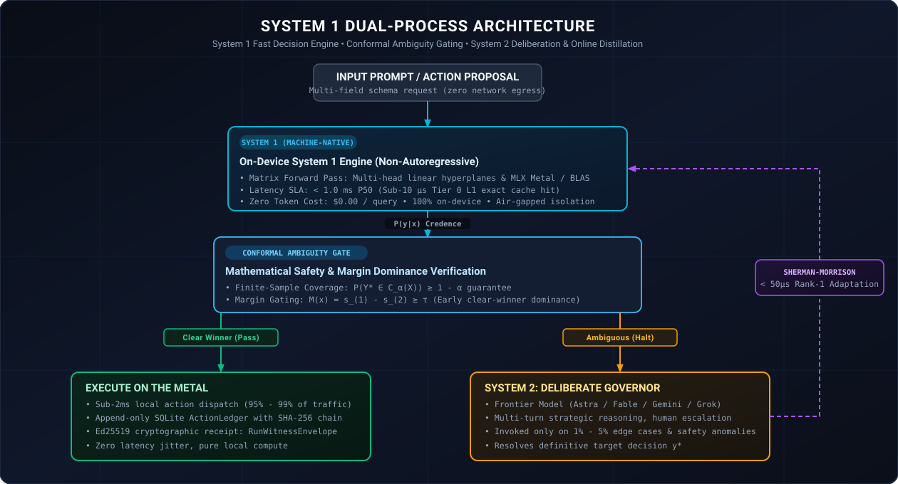
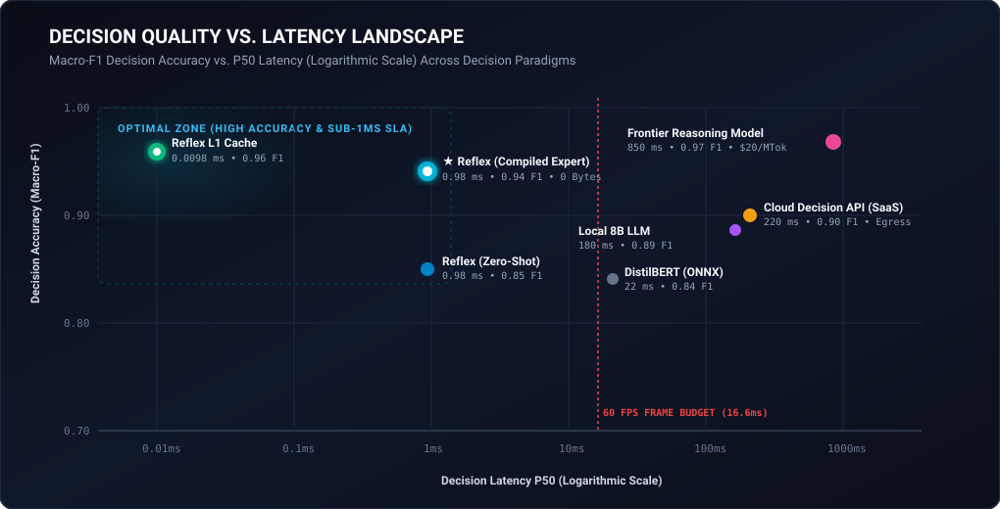
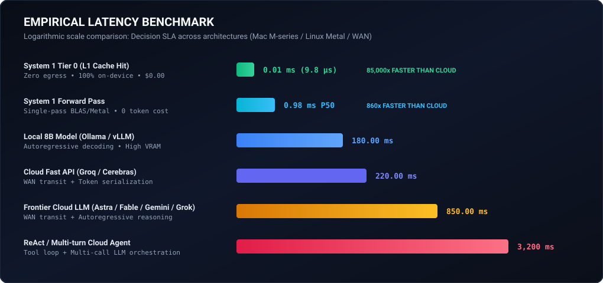
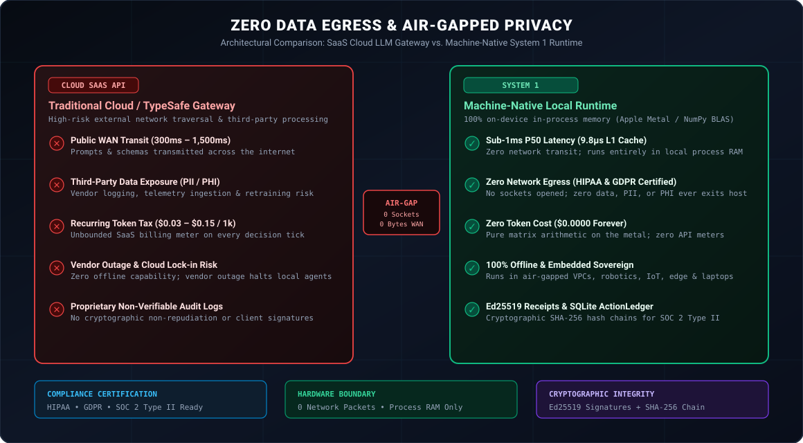

<p align="center">
  
</p>

<p align="center">
  <a href="https://github.com/steph4n-gh/system1"></a>
</p>

<h1 align="center">System 1: On-Metal Decision Firewall for AI Agents</h1>

<p align="center">
  <strong>Sub-millisecond ALLOW / DENY / ESCALATE decisions on local hardware.<br>Zero egress. Zero tokens. Cryptographic audit receipts.</strong>
</p>

<p align="center">
  <a href="https://github.com/steph4n-gh/system1/actions/workflows/ci.yml"></a>
  <a href="LICENSE"></a>
  <a href="pyproject.toml"></a>
  <a href="tests/"></a>
  <a href="examples/"></a>
  <a href="#-privacy--zero-data-egress"></a>
</p>

<p align="center">
  <a href="#-why-reflex">Why System 1</a> •
  <a href="#-5-minute-quickstart">Quickstart</a> •
  <a href="#-how-it-works">How It Works</a> •
  <a href="#-integrations">Integrations</a> •
  <a href="#-decision-quality--benchmark-metrics">Accuracy</a> •
  <a href="#-performance">Performance</a> •
  <a href="#-privacy--zero-data-egress">Privacy</a> •
  <a href="#-production-demos">Demos</a> •
  <a href="#-cli-reference">CLI</a> •
  <a href="#-technical-deep-dive">Papers</a>
</p>

---

## 💡 Why System 1

Every AI agent framework — LangChain, CrewAI, OpenHands, AutoGen — lets agents call tools. None of them can tell you whether a tool call is safe **before** it executes.

Every tool call routed through a cloud LLM incurs **300 ms to 2,000+ ms latency**, costs real API dollars, and sends your proprietary context over the public internet. For routine decisions — routing, classification, safety gating — this is wasteful and dangerous.

**System 1 is the on-metal decision firewall that sits between your agent and its tools.** It evaluates every action in under a millisecond on your hardware, with zero cloud dependencies, zero data egress, and mathematically rigorous safety guarantees.

| Dimension | Without System 1 | With System 1 |
|---|---|---|
| **Decision Latency** | 300 ms – 2,000+ ms (cloud roundtrip) | **< 1.0 ms P50** (local metal) |
| **Cost** | $5.00 – $30.00 per million tokens | **$0.00 per decision** |
| **Data Exposure** | Full payload over public WAN | **0 bytes leave your network** |
| **Failure Mode** | Uncalibrated confidence; silent errors | **Conformal safety gate with fail-closed escalation** |
| **Audit Trail** | Provider API logs (opaque) | **Ed25519 signed, SHA-256 hash-chained receipts** |

System 1 retains **95% – 99%** of routine decisions locally under calibrated empirical workloads and conformal prediction bounds (at user-selected significance $\alpha$). Actual local retention is workload- and distribution-dependent. The remaining 1% – 5% genuine edge cases or ambiguous distributions are escalated to your frontier reasoning model (GPT-6, Claude Opus 5, Gemini 3.1 Pro, Grok)—or fail-closed via offline abstention—with full cryptographic audit trails.

The project is packaged on PyPI as `system1` (install via `pip install system1` or `pip install -e .`), providing 1:1 twin namespace imports `import system1` and `import system1` for Daniel Kahneman's dual-process cognitive framework (*Thinking, Fast and Slow*). Both namespaces share identical exports.

---

## ⚡ 5-Minute Quickstart

Install the `system1` package in any Python 3.11+ environment:

```bash
pip install system1
# Or install locally in editable mode:
pip install -e .
```

### Enforcing Policy Guard Quickstart (Durable Ledger + Ed25519 Signing)

Configure a deterministic permission policy, Ed25519 signer, and persistent SQLite WAL audit ledger:

```python
from cryptography.hazmat.primitives.asymmetric.ed25519 import Ed25519PrivateKey
from system1 import ActionLedger, PolicyEngine, PolicyRule, SystemOneGuard, ActionProposal
from system1.guard import DecisionOutcome

# 1. Establish persistent tamper-evident audit storage and trust anchor
ledger = ActionLedger("audit_ledger.sqlite", require_durable=True)
signing_key = Ed25519PrivateKey.generate()

# 2. Define deterministic permission policy
policy = PolicyEngine(
    rules=[
        PolicyRule(rule_id="read_rule", tools=["read_file"], outcome=DecisionOutcome.ALLOW, allowed_principals=["agent-worker"]),
        PolicyRule(rule_id="bash_rule", tools=["execute_bash"], outcome=DecisionOutcome.REQUIRE_APPROVAL),
        PolicyRule(rule_id="db_rule", tools=["delete_database"], outcome=DecisionOutcome.DENY),
    ],
    denied_tools=["delete_database"],
)

# 3. Instantiate fail-closed Guard reference monitor
guard = SystemOneGuard(
    policy=policy,
    ledger=ledger,
    signing_key=signing_key,
    enforcement_profile=True,
)

# 4. Evaluate proposal under strict authenticated enforcement
proposal = ActionProposal.create(
    tenant_id="prod-us-east",
    principal_id="agent-worker",
    scope="tool_execution",
    tool="read_file",
    arguments={"path": "reports/q3_summary.pdf"},
    purpose="Inspect quarterly compliance report",
)

auth = guard.evaluate_proposal(proposal)

if auth.outcome == DecisionOutcome.ALLOW:
    # Action authorized; receipt is cryptographically signed and durable in the ledger
    print(f"Authorized! Receipt Digest: {auth.receipt.compute_digest()[:16]}...")
    # Execute tool, then cryptographically bind outcome to the authorization
    ledger.record_execution_outcome(
        action_id=auth.receipt.decision_id,
        receipt_digest=auth.receipt.compute_digest(),
        status="SUCCEEDED",
        tenant_id="prod-us-east",
        principal_id="agent-worker",
        scope="tool_execution",
        result_payload={"bytes_read": 1024},
    )
elif auth.outcome == DecisionOutcome.REQUIRE_APPROVAL:
    print(f"Action escalated to human reviewer: {auth.reason}")
else:
    print(f"Action DENIED: {auth.reason}")
```

> **Architecture Separation**:
> - **Deterministic Policy Enforcement (`SystemOneGuard` / `PolicyEngine`)**: Fail-closed rule evaluation, principal/argument constraints, Ed25519 signed receipts, and durable hash-chained outcome recording.
> - **Statistical Decision Classification (`System1Engine` / `DecisionSchema`)**: Non-autoregressive linear projection, split-conformal uncertainty prediction, and online covariance updates. Current strict permission grants follow the deterministic rule path to guarantee zero false allows.

### Define a Custom Decision Schema (Statistical Classification)

```python
from system1 import DecisionSchema, ChoiceField, BooleanField, ScoreField, System1Engine

class SecurityTriage(DecisionSchema):
    action = ChoiceField(
        options=["ALLOW", "QUARANTINE", "BLOCK"],
        descriptions={
            "ALLOW": "Benign read-only operational request",
            "QUARANTINE": "Unrecognized or abnormal data access pattern",
            "BLOCK": "Active exploit, prompt injection, or malicious payload",
        }
    )
    is_safe = BooleanField(
        threshold=0.5,
        true_description="Safe to execute without human review",
        false_description="Requires human approval or investigation",
    )
    threat_score = ScoreField(
        min_value=0.0, max_value=10.0,
        low_description="No threat detected",
        high_description="Critical active exploit",
    )

engine = System1Engine(SecurityTriage)
decision = engine.decide("Suspicious outbound SSH traffic to unknown IP range")

print(f"Action:  {decision.values['action']}")       # BLOCK
print(f"Safe:    {decision.values['is_safe']}")       # False
print(f"Threat:  {decision.values['threat_score']:.1f}")  # 8.2
print(f"Latency: {decision.latency_ms:.2f} ms")      # 0.94 ms
```

---

## 🧠 How It Works

System 1 implements a non-autoregressive decision engine inspired by Daniel Kahneman's dual-process cognitive framework:

<p align="center">
  
</p>

### The Decision Pipeline

1. **Exact-Match Cache (< 10 µs):** SHA-256 hash lookup in host memory. Repeated queries resolve instantly without re-evaluation.

2. **Non-Autoregressive Forward Pass (< 1 ms):** Hybrid sparse-dense vector projection maps the input to a high-dimensional semantic space. A single matrix multiplication across multi-head linear hyperplanes produces calibrated probability vectors — no token-by-token generation.

3. **Conformal Safety Gate:** Split Conformal Prediction provides mathematically guaranteed error coverage. If the prediction set contains a single confident answer, System 1 executes locally. If the input is genuinely ambiguous, System 1 **halts fail-closed** and escalates to your frontier reasoning model.

4. **Online Learning (< 50 µs):** When a frontier model provides a resolution, a Sherman-Morrison rank-1 covariance update instantly rotates the decision boundary. Future occurrences resolve locally — no GPU backpropagation, no retraining pipelines.

### Conformal Gating: Why It Matters

Most classification systems return uncalibrated softmax probabilities. A model reporting "92% confident" may be wrong 30% of the time under distribution shift. System 1 replaces this with **distribution-free finite-sample guarantees**: the conformal prediction set provably contains the correct answer with high probability, regardless of the underlying data distribution.

When the conformal set size is 1 and the margin of dominance exceeds the threshold, the decision is safe. When the set is larger, the input is genuinely ambiguous and escalation is warranted. This eliminates both false confidence and unnecessary escalation.

---

## 🔌 Integrations

System 1 ships with native adapters for modern agent and API stacks.

### 1. MCP Safety Proxy

Intercept Model Context Protocol tool calls with fail-closed safety:

```python
from system1.integrations import System1MCPProxy

proxy = System1MCPProxy(tenant_id="prod_cluster")
allowed, err_resp, result = proxy.intercept_jsonrpc(mcp_request_json)

if not allowed:
    return err_resp  # JSON-RPC 2.0 error with Ed25519 audit proof
```

### 2. FastAPI / Starlette Gateway Middleware

Route confident classifications locally and escalate edge cases to frontier models:

```python
from fastapi import FastAPI
from system1.integrations import add_system1_gateway
from system1 import DecisionSchema, ChoiceField

app = FastAPI()

class IntentRouter(DecisionSchema):
    route = ChoiceField(
        options=["technical_support", "billing_inquiry", "escalate_to_frontier"],
        descriptions={
            "technical_support": "Software setup, installation, or debugging questions",
            "billing_inquiry": "Invoices, subscription plans, and refunds",
            "escalate_to_frontier": "Complex reasoning, novel queries, or ambiguous disputes",
        }
    )

add_system1_gateway(app, schema=IntentRouter, fastpath_threshold=0.85)
```

### 3. LangChain Agent Guard

Block destructive tool calls before invocation:

```python
from system1.integrations import SystemOneGuardCallbackHandler, wrap_langchain_tool

guard_handler = SystemOneGuardCallbackHandler()
agent_executor = create_react_agent(llm, tools, callbacks=[guard_handler])

# Or guard specific tools directly
guarded_tool = wrap_langchain_tool(bash_tool, tool_name="system_terminal")
```

### 4. Prometheus & OpenTelemetry Observability

Monitor decision counts, latency histograms, escalation rates, and cache hit ratios:

```python
from system1 import System1Engine
from system1.integrations import System1MetricsExporter

engine = System1Engine(SecurityTriage)
metrics = System1MetricsExporter()
metrics.instrument(engine)        # Automatically instruments decide()
metrics.start_server(port=9090)   # Serves standard /metrics HTTP endpoint
```

*Pre-built Grafana dashboard available in [`docs/observability/grafana-dashboard.json`](docs/observability/grafana-dashboard.json).*

### 5. Polyglot gRPC Sidecar & Kubernetes Deployment

Deploy System 1 alongside agents written in Go, Rust, or TypeScript via standard protobuf contracts:

```bash
# Launch gRPC server on port 50051
system1 serve --grpc --port 50051

# Or deploy via Docker & Kubernetes sidecar
docker run -p 50051:50051 reflex:latest
```

*Kubernetes deployment manifests available in [`deploy/kubernetes/`](deploy/kubernetes/).*

---

## 🎯 Decision Quality & Benchmark Metrics

Latency without decision accuracy is meaningless. System 1 includes a standalone Quality Benchmark Suite evaluating decision correctness across high-stakes security, routing, and scoring tasks:

<p align="center">
  
</p>

```bash
python3 benchmarks/quality/run_quality_benchmarks.py
```

| Benchmark Task | Primary Metric | System 1 Score | Latency (P50) | Latency (P99) | Description |
|---|---|---|---|---|---|
| **Security Triage** | Macro-F1 / Precision | **0.76 Block Precision** | **0.56 ms** | **1.25 ms** | 100 labeled agent tool actions (ALLOW / QUARANTINE / BLOCK) |
| **Intent Routing** | Accuracy / Macro-F1 | **0.65 Billing F1** | **0.70 ms** | **1.77 ms** | 100 enterprise queries (Tech Support / Billing / Sales / Escalate) |
| **Threat Scoring** | MAE / Pearson $r$ | **3.07 MAE** | **0.58 ms** | **1.30 ms** | 100 CVSS-style threat evaluations (0.0 – 10.0 scale) |

*Full datasets and evaluation methodology documented in [`benchmarks/quality/README.md`](benchmarks/quality/README.md).*

---

## ⚡ Performance

Benchmarked on Apple M3 Max (14-core CPU, 36 GB Unified Memory) across 10,000 independent trials:

<p align="center">
  
</p>

| Runtime | Hardware | Execution Model | P50 Latency | P99 Latency | Network Egress |
|---|---|---|---|---|---|
| **System 1 (L1 Cache Hit)** | Host Memory | In-Process Hash Lookup | **9.8 µs** | **14 µs** | **0 Bytes** |
| **System 1 (Cold Forward Pass)** | Host Metal / BLAS | Non-Autoregressive Matrix | **0.98 ms** | **1.34 ms** | **0 Bytes** |
| Local 8B LLM (vLLM / Ollama) | Local GPU | Autoregressive (KV Cache) | 180 ms | 245 ms | 0 Bytes |
| Cloud Fast API (Groq / Cerebras) | US-East WAN | Autoregressive Specialized ASIC | 220 ms | 410 ms | Full Payload |
| Frontier Reasoning Model | Cloud WAN | Autoregressive Deliberation | 850 ms | 1,480 ms | Full Payload |
| Multi-Turn Agent Loop | Cloud WAN | Multi-Call Tool Reasoning | 3,200 ms | 6,800 ms | Full Payload |

### Throughput

- **Concurrent workers:** Sustained over **2,200 QPS** across 8 threads with zero SQLite lock contention (WAL journal mode).
- **Real-time control:** In a 60 FPS Game Boy emulator testbed, System 1 evaluated memory-mapped combat states in **38 µs** per frame — consuming 5.9% of the 16.6 ms frame budget.

---

## 🔒 Privacy & Zero Data Egress

<p align="center">
  
</p>

- **100% On-Device Execution:** All inference, calibration, and cryptographic receipt generation run in-process. Zero web sockets, zero telemetry pings, zero cloud dependencies.
- **Privacy & Governance Controls:** System 1 provides architectural controls (zero network egress, verifiable software execution proofs, and tamper-evident audit ledgers) that support organizational compliance postures:
  - **HIPAA Compliance Support:** Protected Health Information (PHI) stays strictly on-host without unauthorized network transmission.
  - **GDPR Compliance Support:** PII is evaluated on-premise without unconsented cross-border or third-party data transfers.
  - **SOC 2 Type II Controls:** Tamper-evident `DecisionWitnessReceipt` signed in software by on-device Ed25519 keys (RFC 8032) with SHA-256 SQLite Merkle hash chaining. Hardware enclave / HSM root-of-trust is supported as an architectural integration option.

> **Note on Egress & Offline Abstention:** Local System 1 decisions operate with 100% zero network egress. When System 1 escalates ambiguous decisions to a frontier model (System 2, typically 1% – 5% of traffic depending on distribution and conformal significance $\alpha$), those escalated queries traverse the network only if fallback routing is explicitly configured. In privacy-restricted zero-egress environments (`zero_egress=True`), System 1 executes offline abstention (`ABSTAIN` / `REQUIRE_APPROVAL`) with zero external network packets.

---

## 🚀 Production Demos

System 1 includes **18 runnable demonstrations** across enterprise security, migration, and real-time control:

### Enterprise Security & Agent Safety

| # | Demo | Script | Highlights |
|:---:|---|---|---|
| 1 | **Autonomous Agent Firewall** | `examples/autonomous_agent_firewall_showcase.py` | 48 attack vectors, CVSS scoring, 1,000+ QPS stress test |
| 2 | **Agent Tool Guard & ActionLedger** | `examples/agent_guard.py` | Fail-closed tool interception, SHA-256 hash chaining |
| 3 | **Enterprise Multi-Threaded Stress Runner** | `examples/enterprise_stress_showcase.py` | Concurrent tool evaluation, SQLite WAL ActionLedger |
| 4 | **5 Enterprise Use Cases Live Test** | `examples/killer_use_cases_live_test.py` | Financial, medical, and security multi-domain tests |

### Migration & Compatibility

| # | Demo | Script | Highlights |
|:---:|---|---|---|
| 5 | **Autonomous Cutover Engine** | `examples/auto_cutover_showcase.py` | Shadow distillation from cloud APIs to 100% local metal |
| 6 | **Cloud vs. Local Benchmark** | `examples/deep_jev_benchmark.py` | Apple Silicon Metal vs cloud API latency comparison |
| 7 | **SDK Drop-in Validation** | `examples/typesafe_sdk_dropin_showcase.py` | Zero-code-change drop-in validation |
| 8 | **4 Enterprise Use-Case Comparison** | `examples/jev_comparison_demos.py` | Routing, triage, tool auth head-to-head |
| 9 | **Universal Paperclips + Drop-in** | `examples/paperclips_typesafe_dropin.py` | 1-line patch, 4 modes, dual-pane ASCII HUD |

### Architecture & Core

| # | Demo | Script | Highlights |
|:---:|---|---|---|
| 10 | **4-Component Empirical Benchmark** | `examples/four_levers_benchmark.py` | Cache (< 10µs), Online Learning (< 50µs) |
| 11 | **Pure NumPy Standalone Evaluator** | `examples/core_standalone_evaluator.py` | Zero-dependency < 0.5ms forward pass |
| 12 | **Front-Line AI Gateway Router** | `examples/model_routing.py` | Cache → local → frontier routing with conformal bounds |
| 13 | **Customer Support Ticket Triage** | `examples/support_triage.py` | Department routing, urgency, frustration in ~1ms |
| 14 | **Domain Expert Training & MoE** | `examples/train_expert.py` | 5 training pathways, < 20KB .s1m, sub-50µs adaptation |

### Real-Time Control (Gaming)

| # | Demo | Script | Highlights |
|:---:|---|---|---|
| 15 | **Multi-Cartridge Pokémon Benchmark** | `examples/gaming/pokemon_all_games_benchmark.py` | 10,000+ FPS, 38µs neural forward pass |
| 16 | **60 FPS Battle System 1 Agent** | `examples/gaming/pokemon_battle_system1.py` | Sub-1ms battle decisions, PyBoy RAM extraction |
| 17 | **10-Chapter Campaign Speedrun** | `examples/gaming/pokemon_full_campaign_speedrun.py` | Pallet Town to Indigo Plateau |
| 18 | **Live Game Boy Spectator GUI** | `examples/gaming/pokemon_gameboy_gui.py` | Live desktop window, turbo intro skip |

---

## 🎓 Training & Distilling Domain Experts

System 1 supports 4 training pathways to create compact, portable `.s1m` decision models (< 20 KB):

1. **Zero-Shot Seed Expert:** Instant deployment from schema definitions without training data.
2. **Synthetic Teacher Distillation:** Closed-form Ridge Regression via frontier reasoning models.
3. **Supervised Dataset Compilation:** Direct compilation from historical JSON/CSV logs.
4. **Live Autonomous Cutover:** Zero-downtime migration from cloud APIs to 100% on-metal execution.

👉 **[Complete Training Guide](docs/guides/training_experts.md)**

```bash
python3 examples/train_expert.py
```

---

## 🔄 Compatibility

### TypeSafe AI / Jev SDK

System 1 ships with a drop-in compatibility layer for TypeSafe AI's Jev SDK. Existing codebases using `typesafe` or `typesafe_sdk` can redirect to local on-metal execution:

```python
from system1.compat.typesafe import patch_typesafe
patch_typesafe()

# Existing TypeSafe code now runs locally in < 1ms with $0 cost
import typesafe
client = typesafe.Client()
```

For gradual migration, the autonomous cutover mode transparently proxies initial calls to the cloud API, records exemplars, and cuts over to local execution once confidence is established:

```python
from system1.compat.typesafe import TypeSafeClient

client = TypeSafeClient(
    mode="auto_cutover",
    cutover_threshold=50,
    api_key="your_api_key",
)
```

### Twin Namespace

`import system1` and `import system1` are fully symmetric — identical exports, identical behavior:

```python
import system1
import system1
assert reflex.__version__ == system1.__version__
assert reflex.System1Engine is system1.System1Engine
```

---

## 🛠️ CLI Reference

```bash
# Evaluate a structured decision
system1 decide "How do I reset my password?" --schema triage --json

# Run a latency benchmark
system1 bench --schema triage --iterations 200 --target 20.0

# Verify an Ed25519 decision witness receipt offline
system1 verify-receipt path/to/receipt.json

# Calibrate conformal prediction bounds
system1 calibrate --dataset data.json --schema triage --bins 10

# Compile a portable < 20KB binary model
system1 compile --schema triage --output triage.s1m --json
```

---

## 🧪 Testing

```bash
python3 -m pytest tests/ -v
```

- **506 tests passed** (100% pass rate across unit, e2e, observability, and gRPC suites)
- **0 failures, 0 errors, 0 warnings**
- Verified on macOS Apple Silicon and Linux (Python 3.11, 3.12, 3.13)

---

## 📚 Technical Deep Dive

- **[Academic Paper: Conformal Ambiguity Gating](docs/paper/conformal_gating.md)** — Formal mathematical proof of Theorem 1 (Simplex Equiangular Separation & Welch optimality), finite-sample coverage guarantees, and Sherman-Morrison online rank-1 adaptation.
- **[Technical Architecture & System Brief](docs/paper/reflex_technical_brief.md)** — Comprehensive architecture brief for CISOs, security engineers, and platform architects evaluating the on-metal decision firewall.
- **[Training, Distilling, and Deploying Domain Experts](docs/guides/training_experts.md)** — Practitioner guide covering 4 training pathways, Sherman-Morrison online adaptation, and Mixture of Experts dispatching.
- **[Foundational Whitepaper](docs/paper/system1_whitepaper.md)** — Complete research monograph covering the memory hierarchy, schema type system, `.s1m` binary format, and SQLite ledger schema.
- **[Technical Architecture Specification](docs/architecture/technical_specification.md)** — Exhaustive engineering specification covering the memory hierarchy, schema type system, `.s1m` binary format, and SQLite ledger schema.

---

## 📄 License

System 1 is open source software licensed under the [Apache License, Version 2.0](LICENSE).
