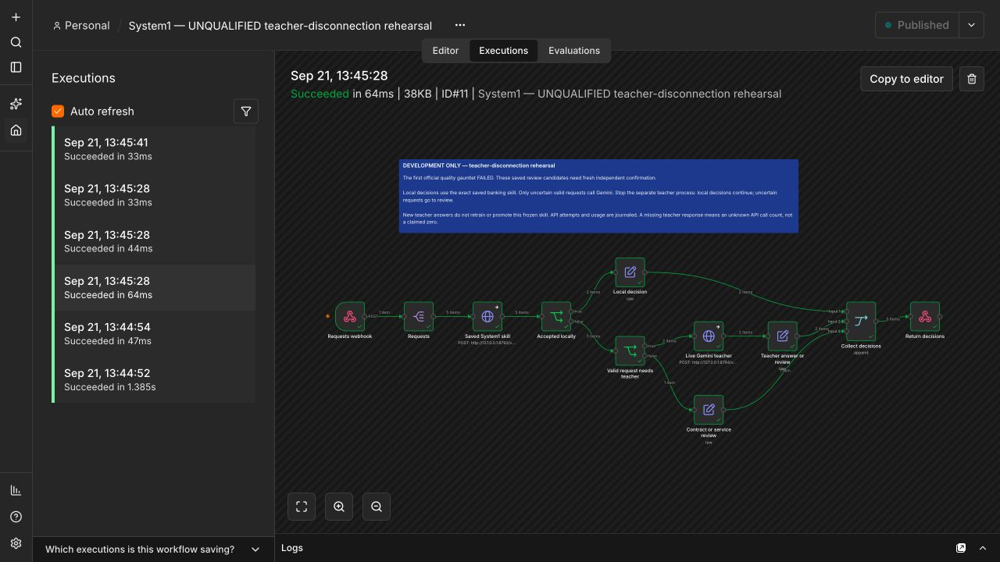

# Development-only teacher-disconnection rehearsal

Declared before this rehearsal's live calls. This is an integration check, not
the qualified recording. The first official gauntlet failed; fresh independent
confirmation of both full taxonomies remains required. No quality gate changes.

Use the saved `artifacts/banking-review` candidate, manifest SHA-256
`956d19c5444e66a238645abfe72e01f2b8b18d6dff2e80d57d40e87b4b305767`.
This skill includes the already recorded 924 Gemini-generated teaching examples.
New fallback answers do not teach, alter, or promote this frozen candidate.

The fixed `rehearsal-probes.json` selects the first two accepted and first two
reviewed development groups in lexicographic SHA order from retained experiment
2a decisions, plus one malformed input. This deliberately exercises both branches;
it is not a representative sample or an accuracy evaluation. No official test or
unused human OOS reserve is opened. Only text and the bound category contract are
sent to the teacher, never expected labels or local suggestions.

Run the local classifier and Gemini bridge in separate loopback processes. The
local process has no teacher key; on macOS deny outbound connections with
`sandbox-exec` and verify an external connection fails with EPERM before serving.
The teacher uses `gemini-2.5-flash`, temperature zero, no thinking, 256 maximum
output tokens, a schema-bound choice including explicit review, and no retries.
Retain request/response bodies, usage, elapsed time, failures and attempted calls
in a fresh journal, without credentials. Cap the process at ten provider attempts;
the planned connected check needs two. Failed checks remain evidence, never
silently replaced. Actual billed cost is unavailable.

In real n8n, check mixed and all-local batches while connected. Stop the teacher
process, verify its port refuses connections, then check mixed, all-local and
all-review batches. Accepted local results must stay identical. Review cases must
remain explicit reviews, with no new provider attempts in the journal. Also stop
the local service and confirm review without calling the teacher. Preserve item
IDs, malformed input and invalid-token behavior in every applicable check.

`teacherRequests` counts n8n-to-bridge attempts. `teacherCalls` counts attempted
provider calls reported by that bridge, including failed provider requests. If
the bridge response is missing, `teacherCalls` is null, not an invented zero.
The stopped-process control and unchanged journal separately establish zero new
provider calls during this controlled disconnection. A returned teacher label is
not automatically evidence of correctness.

## Observed result, 2026-09-21



- [Connected](results/rehearsal-connected.json): seven decisions across mixed and
  all-local batches; two actual Gemini responses, four local decisions and one
  malformed-input review. The mixed batch took 1,410.14 ms end to end.
- [Teacher stopped](results/rehearsal-disconnected.json): ten decisions across
  mixed, all-local and all-review batches; four local decisions and six reviews.
  No new provider calls; journal bytes unchanged. Both complete local response
  objects matched the connected phase exactly. The mixed batch took 82.28 ms.
- [Local service also stopped](results/rehearsal-local-down.json): both requests
  reviewed, without attempting the teacher bridge. No new provider calls.
- Every phase rejected the invalid webhook credential; all item IDs and original
  text survived branch merging. Unit tests additionally cover changed contracts,
  invalid teacher choices, provider HTTP failure, call limits and secret exclusion.

These small, deliberately selected batches measure integration behavior. Their
end-to-end times are not a head-latency benchmark or a general speedup claim.
The actual n8n instance is 2.39.10; connected mixed execution is #9, disconnected
mixed execution #11 and local-service shutdown #14. No video is claimed here.

[Complete teacher evidence](results/rehearsal-teacher.json) retains both exact
requests and responses: 2,155 input tokens, 21 output tokens, and 2,176 total.
The standard paid-price estimate is $0.000699 at $0.30/M input and $2.50/M output
from [Google's pricing](https://ai.google.dev/gemini-api/docs/pricing#gemini-2.5-flash),
checked September 21, 2026. Actual billing is unknown. These are fallback costs,
separate from the earlier [teaching cost](results/contrast-teacher-summary.json).

## Reproduce

Use the native n8n setup and shared service credential from [N8N.md](N8N.md).
The services use the same optional HTTP/research dependencies. Download the pinned
BGE encoder if it is not already present:

```bash
hf download BAAI/bge-small-en-v1.5 tokenizer.json onnx/model.onnx --revision 5c38ec7c405ec4b44b94cc5a9bb96e735b38267a --local-dir .system1/n8n-gauntlet/bge-small
python benchmarks/quality/n8n_gauntlet/make_rehearsal_workflow.py
```

Import [n8n-disconnection-rehearsal.json](n8n-disconnection-rehearsal.json), select
the existing HTTP Header Auth credential on the webhook and both HTTP nodes, and
publish locally. The credential-free export checks the exact saved manifest hash.
It exposes `/webhook/system1-disconnection-rehearsal` on the local n8n instance.

In one terminal, set `SYSTEM1_CLASSIFIER_TOKEN` to that local service credential
and start the keyless classifier. The macOS sandbox prevents outbound connections
while allowing it to accept loopback HTTP requests:

```bash
env -u GEMINI_API_KEY -u TYPESAFE_API_KEY sandbox-exec -p '(version 1) (allow default) (deny network-outbound)' \
  python benchmarks/quality/n8n_gauntlet/serve_rehearsal.py local
```

In a separate terminal with the same service token and a privately supplied
`GEMINI_API_KEY`, start the teacher. Choose a fresh journal filename for every
process; existing journals are never overwritten:

```bash
python benchmarks/quality/n8n_gauntlet/serve_rehearsal.py teacher --journal .system1/n8n-gauntlet/my-rehearsal-teacher.jsonl
```

From a third terminal with the service token, run:

```bash
python benchmarks/quality/n8n_gauntlet/check_rehearsal.py connected --journal .system1/n8n-gauntlet/my-rehearsal-teacher.jsonl --output .system1/n8n-gauntlet/my-connected.json
```

Stop only the teacher with Ctrl+C, then run the same command with `disconnected`
and a fresh `--output` path. Stop the local service too and run `local-down` with
another output path. The checks verify refused connections and an unchanged
provider journal in the stopped phases. Reusing an output path is rejected so a
failed check cannot silently disappear. Start the local service again afterward;
the teacher may remain disconnected.
