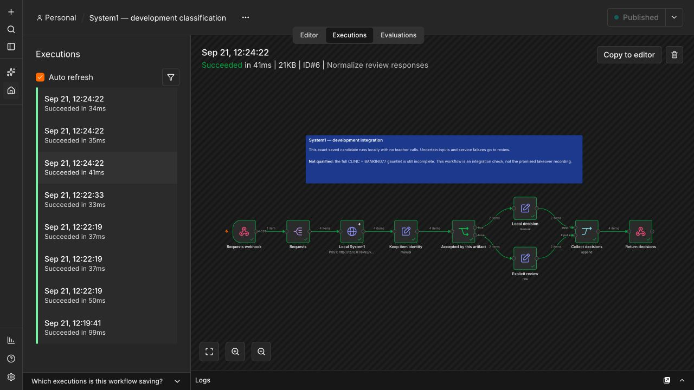

# Development integration in real n8n

**Not the qualified takeover demonstration.** The
[first held-out gauntlet failed](results/official-test.md), and the final
teacher-disconnection recording remains incomplete. This working integration
uses the same CLINC development artifact that was timed and replayed offline.
It uses built-in n8n nodes; no community node or custom n8n package is needed.

A separate [teacher-disconnection rehearsal](DISCONNECTION_REHEARSAL.md) now uses
the newer saved banking review candidate, a real Gemini fallback, and a stopped
teacher process. It retains the original workflow below and remains unqualified.



The authenticated webhook accepts `{"requests":[{"id":"one","text":"..."}]}`.
Split Out preserves each request, HTTP Request calls the local System1 service,
and an IF node checks both review status and the exact returned artifact identity.
Local decisions and explicit reviews then merge into a response. Original item
IDs survive both branches. Service errors become review objects with no category;
internal HTTP error details do not become application decisions.

The saved manifest SHA-256 is
`27edb13093e6b4ef8c6edb131e21009e1809cbfc740c4e178de55f2ad4a5063f`.
The manifest binds the head, density guard, encoder files/settings, categories,
instructions and acceptance thresholds. The workflow verifies that identity.
Changing the artifact requires a regenerated workflow and a new evaluation.

## Reproduce on a local development machine

This setup was exercised with Node 24.3.0, n8n 2.39.10, Python 3.13.5, ONNX Runtime
1.30.0 and tokenizers 0.22.2 on an Apple M4 Pro. It uses native n8n on loopback;
container networking and n8n Cloud have not been qualified.

From the repository root, install the optional research/HTTP dependencies:

```bash
python -m pip install -e '.[http]' 'onnxruntime==1.30.0' 'tokenizers==0.22.2' threadpoolctl
hf download sentence-transformers/all-MiniLM-L6-v2 tokenizer.json onnx/model_qint8_arm64.onnx --revision 1110a243fdf4706b3f48f1d95db1a4f5529b4d41 --local-dir .system1/n8n-gauntlet/minilm
mkdir -p .system1/n8n-gauntlet/clinc-runtime-candidate
cp benchmarks/quality/n8n_gauntlet/artifacts/clinc-development/* .system1/n8n-gauntlet/clinc-runtime-candidate/
export SYSTEM1_CLASSIFIER_TOKEN="$(python -c 'import secrets; print(secrets.token_urlsafe(32))')"
python benchmarks/quality/n8n_gauntlet/serve_candidate.py
```

Retain that service token for n8n's credential and the check command. It is a local
service credential, not a Jev or Gemini key. The server loads the saved skill and
guard; it never contacts a teacher. Encoder weights total 23,026,053 bytes, with a
466,247-byte tokenizer and about 1.25 MB of saved head/guard/manifest, before
runtime libraries. This is not the default hashed-feature System1 installation.

In another terminal, install and start an isolated n8n instance:

```bash
npm install --prefix .system1/n8n-runtime n8n@2.39.10 --no-audit --no-fund
N8N_USER_FOLDER="$PWD/.system1/n8n-state" \
N8N_HOST=127.0.0.1 N8N_LISTEN_ADDRESS=127.0.0.1 N8N_PORT=5681 \
N8N_DIAGNOSTICS_ENABLED=false N8N_VERSION_NOTIFICATIONS_ENABLED=false \
N8N_TEMPLATES_ENABLED=false N8N_SECURE_COOKIE=false \
.system1/n8n-runtime/node_modules/.bin/n8n start
```

Open [local n8n](http://127.0.0.1:5681), complete its local owner setup and import
[the workflow JSON](n8n-development-workflow.json). Create an **HTTP Header Auth**
credential named `System1 local classifier`, with header `Authorization` and value
`Bearer <the service token>`. Select it on both Requests webhook and Local System1.
The exported workflow contains a placeholder credential reference, never a token.
Publish the workflow in this local instance to register its webhook.

With the same `SYSTEM1_CLASSIFIER_TOKEN` in the check terminal:

```bash
python benchmarks/quality/n8n_gauntlet/check_workflow.py
```

This checks a mixed batch, an all-local batch and an all-review batch: eight
decisions, preserved IDs, correct timer/translation routing, unfamiliar-input
review, malformed-input review and rejection of an invalid credential. The
[executed responses](results/n8n-integration.json) include actual HTTP/n8n timings;
these are separate from the much smaller in-process System1 latency.

Stop **the classifier service** with Ctrl+C in its terminal, leaving n8n running,
then execute `python benchmarks/quality/n8n_gauntlet/check_workflow.py --service-down`.
Both requests must go to review. [Recorded evidence](results/n8n-service-down.json)
retains this test. Restart the service with the same token and artifact afterward.
This verifies local-service failure handling; it is not the requested live-teacher
disconnection experiment, which remains pending qualification.

## Artifact and isolation evidence

[The complete development artifact](artifacts/clinc-development/manifest.json)
and [per-request runtime evidence](results/runtime-development.json) are retained.
All 3,095 development decisions, including their complete review responses,
replayed identically with OS network access denied. Changed categories and
instructions went to review, malformed inputs were rejected, and changed artifact
bytes prevented loading. The [isolation result](results/runtime-isolation.json)
records the OS permission error from a control connection attempt.

After preparing the pinned development folds with `prepare.py`, reproduce that
check on macOS with:

```bash
sandbox-exec -p '(version 1) (allow default) (deny network*)' \
  python benchmarks/quality/n8n_gauntlet/verify_runtime.py
```

The script checks the saved development candidate against its retained decisions.
It never evaluates an official test. This experimental service does not implement
arbitrary n8n Text Classifier features such as multiple simultaneous categories,
output repair or free-form instructions. The declared scope is one bound,
single-label intent decision with explicit review.
