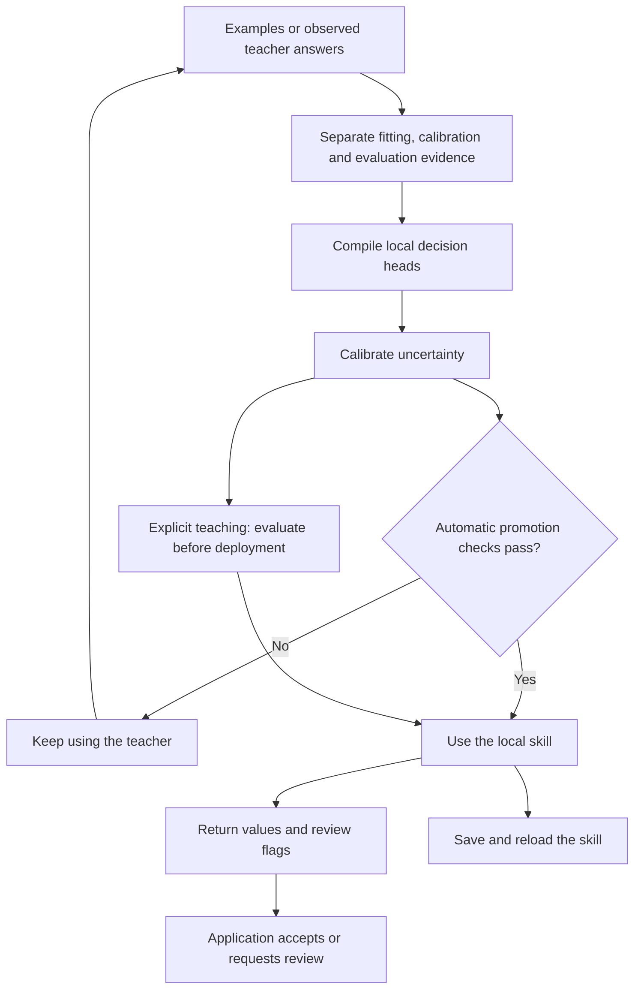

# System 1 architecture and implementation

Implementation reference for **System 1 1.0.3**, reviewed 20 September 2026.
The [whitepaper](../paper/system1_whitepaper.md) explains the product and evidence;
this document maps its behavior to the source. The package version is defined in
[pyproject.toml](../../pyproject.toml).

## The product loop

A skill maps a bounded input to a declared set of outputs. A teacher supplies
labels; the local compiler learns a small numerical decision head over fixed
features. Teaching can use a file of reviewed examples or observations of an API,
LLM, rule, or callback. System 1 does not download or fine-tune a language model.

This diagram describes the lifecycle. A single `decide()` call returns a decision;
it does not run the teacher, execute a tool, or perform the entire lifecycle.

## Components and actual defaults

| Component | Responsibility | Source |
|---|---|---|
| `DecisionSchema` and field classes | Choice, Boolean, MultiChoice and continuous score outputs; field-level review configuration | [schema](../../src/system1/core/schema.py) |
| `DeterministicSemanticProjector` | SHA-256-derived signed word, subword and character features, normalized into 384 dimensions by default | [core model](../../src/system1/core/model.py) |
| `HybridProjector` | Optional hashed lexical features plus a seeded subword table with curated semantic anchors | [embeddings](../../src/system1/core/embeddings.py) |
| `SystemOneCompiler` | Validate labels, partition examples, fit ridge heads, calibrate, serialize | [compiler](../../src/system1/compiler.py) |
| `System1Engine` / `SystemOneEngine` | Apply a schema or compiled skill, uncertainty checks, optional caching and audit evidence | [engine](../../src/system1/engine.py) |
| TypeSafe `Client` / `AsyncClient` | Teacher observation, per-schema promotion, local typed responses and skill reuse | [adapter](../../src/system1/compat/typesafe.py) |
| `PolicyEngine` / `SystemOneGuard` | Explicit permissions and guarded proposal evaluation | [guard](../../src/system1/guard.py) |
| Receipts / `ActionLedger` | Software signatures and a local hash-chained event record | [receipts](../../src/system1/receipt.py), [ledger](../../src/system1/ledger.py) |

The deterministic projector uses words, character 3/4-grams within words, adjacent
word pairs and cross-word character 4-grams. Its hashes are SHA-256, not MurmurHash;
there is no corpus-fitted IDF or pretrained contextual language model. Positional
weighting is built in; recency weighting is optional. Shared lexical features
allow generalization to new combinations, but lexical overlap is not meaning.

`HybridProjector()` defaults to 1,024 lexical and 256 dense dimensions with mixing
weight 0.5 and seed 42. Supplying `dimension` divides it approximately 75%/25%.
The table is generated locally and adjusted by curated anchors. It is an optional
representation, not the compiler's default or an independently learned language
understanding system.

The compiler defaults to 384 features, ridge regularization 1.0 and NumPy.
Published explicit-teaching workloads use 2,048 features and regularization 0.1;
the automatic-observation experiments retain regularization 1.0. These settings
are different paths, so their results must not be conflated.

## Teaching and calibration

`compile(examples, augment=False)` uses supplied labels only. Python compilation
retains `augment=True` as its legacy default; the CLI with `--dataset` and the
normal observation adapter default to examples-only teaching. Missing classes,
unknown fields and malformed labels are errors. Schema templates are useful
starter data, not independent observations.

The compiler reserves about 25% of unique prompts for calibration unless explicit
`calibration_exemplars` are provided. Repeated normalized prompts stay together.
Categorical, Boolean and MultiChoice calibration separate temperature fitting
from conformal scoring. Application-defined related groups need to be split by
the caller; ordinary compilation cannot discover paraphrases or shared sources.
Evaluation data must stay outside both fitting and calibration.

The fitting code augments features with a bias column and solves regularized
normal equations. It currently computes a NumPy inverse and multiplies by the
cross-product, with pseudoinverse/least-squares fallback on `LinAlgError`.
It does not use the Cholesky implementation described in earlier drafts.
Stored inference weights have shape `(number_of_outputs, feature_dimension)`.

## Local decisions and uncertainty

`System1Engine` is an alias of `SystemOneEngine`. Both `system1` and legacy
`reflex` imports expose the same implementation. Install the `system1`
distribution and use the `system1` CLI; the unrelated Reflex web framework is a
different distribution.

Direct Python engines default to `strict_mode=False` for compatibility. For a
taught skill, use `strict_mode=True`; saved-model CLI decisions and normal
observed skills use strict review. A returned best-guess value can still need
review. `ambiguous_fields` records field uncertainty, while `escalated_fields`
contains the fields configured to affect the overall `is_ambiguous` flag.

Examples-only categorical/Boolean teaching uses LAC scores; legacy and augmented
skills retain APS scores. Strict mode inverts the saved score definition.
MultiChoice checks a unique complete assignment, including an empty assignment
when supported by evidence. Score fields have their own interval/review behavior.
The categorical singleton rule must not be described as every field's contract.

Non-strict mode includes confidence and margin heuristics. Strict mode does not
permit those heuristics to bypass inadequate conformal evidence. Prediction-set
coverage is marginal under exchangeability, not accuracy conditional on local
acceptance or permission to execute an action. See the [mathematical note](../paper/conformal_gating.md).

The cache supports exact and vector lookup primitives. Compiled inference and
engine cache checks bind results to the input, telemetry and model state; nearby
text cannot substitute for a distinct compiled prediction. Cache hits do not
certify an action. The public workload timings disable caches and receipts.

## Observation and automatic promotion

The [adapter contract](../typesafe.md) is the detailed reference. In
`mode="auto_cutover"`, teacher answers continue until that schema's candidate
qualifies. Compilation and transition are synchronized in the request path;
there is no guaranteed background compilation or zero-latency transition.

Defaults are a 50-observation earliest attempt, 80% agreement, 80% local acceptance,
95% statistical confidence and zero observed critical false-allows. Candidates
are checked on disjoint, fresh validation groups, using complete output agreement
and agreement among accepted responses. Exact one-sided binomial lower bounds
and a summable budget across attempts constrain repeated promotion checks.
Independent representative groups are still required for statistical meaning.

Since 1.0.2, `PromotionPolicy(min_accepted_agreement=.95)` optionally requires
both point agreement and an exact lower bound on accepted validation groups.
The three exact bounds share the repeated-attempt confidence budget. This
measures teacher agreement, not independent correctness. Sync and async adapters
also expose the compiler's existing `regularization` setting (default 1.0).
See [qualification settings and evidence](../typesafe.md#what-promotion-means).

A promotion threshold is not a promised number of teacher calls. The gate's 80%
thresholds are also not the separate 95% accepted-correctness workload target.
The assistant, banking and SMS experiments demonstrate why the distinction matters.

Promotion and drift state are per schema. A local response can still request
review. Fallback is explicitly configured; `zero_egress=True` prevents the
adapter's own HTTP fallback, not network calls made by a user callback or tool.

## Persistence and corrections

Format-v2 `.s1m` files contain schema, projector configuration, weights, temperature,
calibration scores and score semantics; adapter exports retain evaluated review
settings. Built-in projectors can be reconstructed. External projectors must be
supplied and should expose a configuration digest. Readers validate versions,
shapes, schema identity and finite numerical values. Version 1.0.3 also reads v1
skills with legacy APS semantics; 0.2.x readers cannot read v2.

The loader bounds file/header size, schema complexity, compressed and expanded
arrays, and runtime allocation before materializing arrays or projectors. It
checks NPY shapes and floating-point types before NumPy loading, including
covariance and calibration state. See the [exact budgets](../deployment.md#saved-skill-resource-limits).

Saving a validated skill is tested to preserve values, probabilities, prediction
sets and review flags. Online correction methods, including `learn_from_tier2`
and its aliases, invalidate changed heads' calibration and caches. Recalibrate
on separate examples before strict acceptance. Retaining examples and recompiling
is the simplest reproducible update process.

Optional recursive least-squares updates use retained covariance state where
available. Their forgetting and numerical stabilization differ from unweighted
batch equivalence in ideal arithmetic. No fixed update-latency guarantee is made.

## Permissions, audit and integrations

Classification is separate from deterministic authorization. Use
`SystemOneGuard(enforcement_profile=True)` with explicit grants, a signing key
and durable ledger. The application supplies authenticated identity and executes
only the authorized operation. The library is an in-process hook, not an OS
sandbox or hardware execution proof.

Receipts use software Ed25519 signatures. The SQLite ledger is a linear SHA-256
hash chain. Trusted keys and external head checkpoints are needed to assess
provenance and rollback; neither artifact proves a tool executed correctly.
Receipts and ledgers are optional on ordinary classification paths.

Receipt authentication requires an independently supplied public key. Diagnostic
integrity checks do not authenticate a signer. After append, the existing signed
envelope binds the committed ledger record ID while the core receipt digest stays
stable. Guards check exact stored receipt inclusion; write transactions reverify
the complete chain. See [audit migration details](../releases/1.0.3.md).

LangChain, MCP, ASGI, gRPC, Prometheus and OpenTelemetry are adapters around these
contracts. gRPC's diagnostic CLI has insecure transport and defaults to loopback.
Remote schema selection is restricted to built-ins and exact startup registrations;
file/import/inline-JSON loading belongs to the trusted local CLI path.
Experimental container templates exist but no published image or authenticated
service is supplied. Read [deployment boundaries](../deployment.md) and
[observability](../observability/README.md) before exposing an endpoint.

The base distribution depends on NumPy and cryptography. The isolated `system1.core`
layer can run with NumPy alone. Optional MLX/neural and emulator paths are
experimental; they are not dependencies of the demonstrated teaching workflow.
